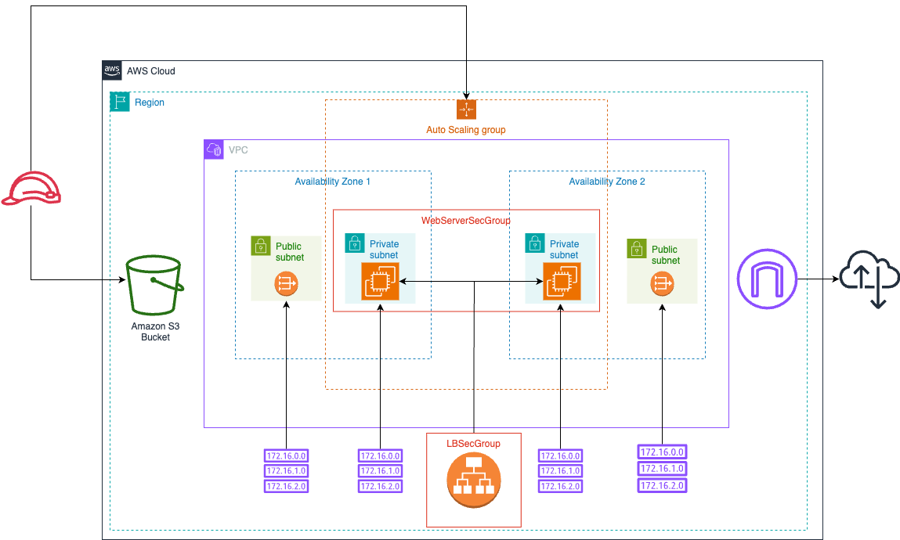

# Deploy a high-availability web app using AWS CloudFormation

This project deploys web servers for a highly available web app using CloudFormation. It creates and deploys the infrastructure and application for an Instagram-like app from the ground up. This involves networking components, followed by servers, security roles and software. 



## Getting Started

### Dependencies

1. AWS CLI installed and configured in your workspace using an AWS IAM role with Administrator permissions.


### Installation

You can get started by cloning this repo in your local workspace:

```
https://github.com/kevahwin/cloudformation-iac-project.git
```

## Project Instructions

1. Design your solution diagram using a tool of your choice and export it into an image file.

2. Add all the CloudFormation networking resources and parameters to the `network.yml` and `network-parameters.json` files inside the `starter` folder of this repo.

3. Add all the CloudFormation application resources and parameters to the `udagram.yml` and `udagram-parameters.json` files inside the `starter` folder of this repo.

4. Create any required script files to automate spin up and tear down of the CloudFormation stacks.

5. Update the README.md file in the `starter` folder with creation and deletion instructions, as well as any useful information regarding your solution.
   
6.  Submit your solution as a GitHub link or a zipped file containing the diagram image, CloudFormation yml and json files, automation scripts and README file.

## Acknowledgements

This is the final project of course 2 Infrastructure as Code in the Cloud DevOps Engineer Nanodegree.
Please note that all supporting and starter material for this course can be found in [this Github repository](https://github.com/udacity/cd12352-Deploy-Infrastructure-as-Code).
